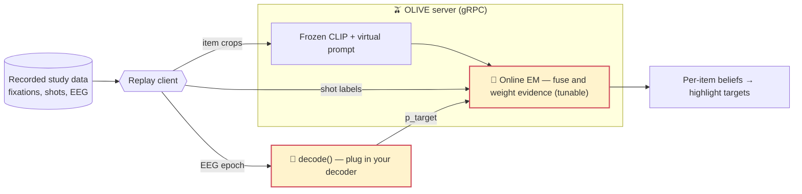
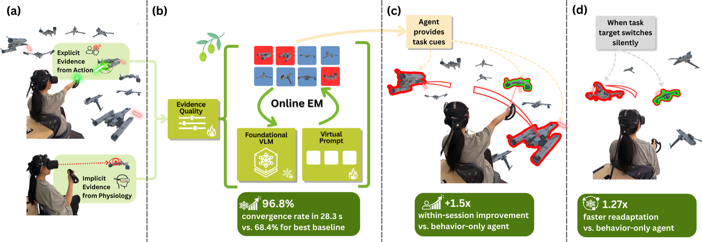
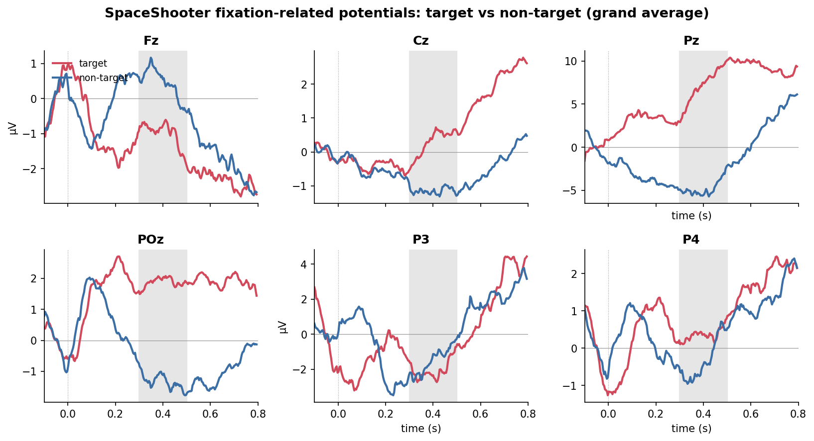
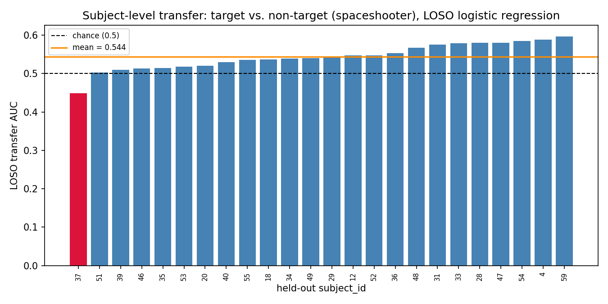

<div align="center">

# 🫒 OLIVE

### Adapt a foundation model to whatever you're doing — in real time, from your **brain signals** and behavior.

Ziheng "Leo" Li\* · Xichen He\* · Haoyan Chen\* · Charlie Zou\* · Sheng Bai · Benjamin Yang · Mengyuan Wu · Jake Ledner · Yi-Jie Cheng · Akito Yamauchi · Dishita G. Turakhia · Steven Feiner · Paul Sajda

[](#citation)
[](https://huggingface.co/datasets/ApocalyVec/olive-frp)
[](#installation)
[](LICENSE)

<a href="assets/olive_demo_30s.mp4"></a>

**▶ [Watch the full 30-second video (with audio)](assets/olive_demo_30s.mp4)**

</div>

OLIVE reads **implicit neural evidence** — fixation-locked EEG, the spotlight of this work — alongside **explicit behavior**, and continuously re-aims a *frozen* vision–language model at what you are actually trying to do. No labels, no offline training: it fuses the two streams online and learns how much to trust each one on the fly. This repository is a **ready-to-use package** to run OLIVE, watch it adapt on real recorded data, and start experimenting with your own ideas.

## ✨ What's inside

- 🎮 **A real-time demo** — watch OLIVE adapt live on our recorded XR user-study data, converging on the targets you care about. → [Quickstart](#quickstart--demo)
- 🔌 **Plug-and-play** — drop in your own EEG decoder or tune the online-EM update and immediately see the effect on convergence. → [Extending OLIVE](#extending-olive)
- 🤗 **Two ready-to-use datasets** — fixation-related potentials (FRP) and an error-related-negativity (ERN) variant, one `load_dataset` away. → [Dataset](#-dataset)
- 🔬 **The full study, reproducible** — every table and figure in the paper regenerates from committed recipes. → [Reproducing the paper](#reproducing-the-paper)

Everything is organized so you can `git clone` and start playing with the data and the algorithm in minutes.

## How the demo works

The demo replays real recorded sessions into the OLIVE server and streams back its evolving beliefs — the exact loop the live XR agent used, minus the headset. The two **🔌 marked** spots are where you plug in:



Swap `decode()` for a stronger brain decoder, or change how the EM weights and updates its beliefs — then measure convergence with the built-in reproduction tools. That's the whole point of shipping this: a clean surface to make OLIVE better.

## Abstract

> We present **OLIVE**, a framework for adapting a foundation model to provide real-time assistance in temporally demanding, high-stakes, and dynamic tasks. Passive EEG, fused online with behavioral evidence, meaningfully extends the number of targets users detect and engage beyond their unaided action bandwidth. OLIVE learns from both *explicit behavioral signals* (targets the user shoots down in an XR first-person shooter) and *implicit physiological signals* (fixation-locked EEG), continuously adapting a frozen vision–language model's inference on which items are task-relevant by jointly estimating per-source reliability — no manual labels, no offline training. Across three user studies including two live XR deployments, OLIVE outperforms prior test-time adaptation in convergence speed and likelihood, gives the largest and most reliable within-session improvement to a user's ability to detect and engage targets (largely independent of skill), and, when the target switches silently, reconverges **1.27× faster** than a behavior-only agent (*p* = .008).

## Key results

<div align="center"></div>

OLIVE-IE reaches **96.8% guidance convergence in 28.3 s**, delivers the largest within-session throughput gain, and — the headline for the brain-signal channel — **reconverges 1.27× faster** than behavior alone after a silent task switch (*p* = .008).

## Repository layout

| Path | What |
|---|---|
| `olive/server.py` | decoder-free OLIVE gRPC server (online EM + CLIP scorer) |
| `olive/decode.py` | the pluggable `decode()` seam (default per-fixation decoder) |
| `reproduce/` | one wrapper per paper table/figure + `reproduce_all.py` |
| `dataset/` | FRP dataset builder + `dataset/ern/` (ERN variant) |
| `examples/` | ERP and subject-transfer example notebooks |
| `AGENTS.md` | working-with-agents guide |

## Installation

```bash
git clone https://github.com/ApocalyVec/olive && cd olive
python -m venv .venv && . .venv/bin/activate
pip install -r requirements.txt         # + the parent OLIVE repo's requirements
mkdir -p save_files                     # cache dir for the US1 simulation
```

> **Note:** the reproduction wrappers call analysis scripts from the main OLIVE research repo
> (`analysis/repro/…`) and the dataset builders read `~/wingman/`; run this release from inside a
> checkout of the full repo. See [`REPRODUCE.md`](REPRODUCE.md).

## Quickstart / Demo

```bash
# 1) Boot the OLIVE server (CLIP ViT-B/16; CPU / MPS / CUDA)
PYTHONPATH=. python -m olive.server --port 50055

# 2) Run OLIVE on recorded data and watch beliefs converge
PYTHONPATH=. python -m reproduce.us1 --participants 5 20 --steps 90 --num-trials 5 \
    --addr localhost:50055 --output-dir outputs/us1
PYTHONPATH=. python -m reproduce.us1_convergence outputs/us1/secondStats.csv
```

## 🤗 Dataset

Two configs on the [**Hugging Face dataset**](https://huggingface.co/datasets/ApocalyVec/olive-frp):

```python
from datasets import load_dataset
frp = load_dataset("ApocalyVec/olive-frp", "default")  # fixation-locked FRP epochs
ern = load_dataset("ApocalyVec/olive-frp", "ern")      # response-locked ERN epochs
```

- **`default`** — per-fixation EEG (20 ch, [-0.1, 0.8] s) + pupil epochs, target label (`y==1`=target), a per-block `task` field, condition/block metadata, and a per-fixation implicit-evidence `p_target` (US2/US3). 25 subjects.
- **`ern`** — response-locked EEG ([-200, 600] ms) labeled error (friendly fire) vs correct (enemy hit).

The target-vs-non-target signal is clearly present in the raw epochs (SpaceShooter, grand average):

<div align="center"></div>

<table>
<tr>
<td width="50%"></td>
<td width="50%" valign="top">

**Example notebooks** ([`examples/`](examples/)):
- [Target-vs-non-target ERP](examples/erp_target_vs_nontarget.ipynb)
- [Leave-one-subject-out transfer decoding](examples/subject_transfer_decoding.ipynb) — a starting baseline you can beat with a better decoder.

</td>
</tr>
</table>

## Reproducing the paper

Every paper table and figure regenerates from a committed recipe, and `reproduce_all.py` checks
each reproduced value against the paper:

```bash
PYTHONPATH=. python -m reproduce.reproduce_all   # Tables 2–8 + Fig 6 → all PASS
```

`REPRODUCE.md` documents each command, cohort, and expected cells. (US2/US3 numbers come from
analysis over the live-logged data; US1 is a seeded simulation re-run through OLIVE.)

## Extending OLIVE

- **Bring your own decoder** — implement the `Decoder` protocol in `olive/decode.py`; the released
  `p_target` column is a baseline to beat.
- **Tune the EM** — prompt lr, prevalence anchor, EMA smoothing — and measure the effect with
  `reproduce/us1_convergence.py`.

See [`AGENTS.md`](AGENTS.md) for a full working-with-agents guide.

## Citation

```bibtex
@inproceedings{li2026olive,
  title     = {Augmenting Human Performance with an XR Agent Learning from
               Online Behavior and BCI Evidence},
  author    = {Li, Ziheng and He, Xichen and Chen, Haoyan and Zou, Charlie and
               Bai, Sheng and Yang, Benjamin and Wu, Mengyuan and Ledner, Jake and
               Cheng, Yi-Jie and Yamauchi, Akito and Turakhia, Dishita G. and
               Feiner, Steven and Sajda, Paul},
  booktitle = {Proceedings of the 38th Annual ACM Symposium on User Interface
               Software and Technology (UIST)},
  year      = {2026}
}
```

## License

See [`LICENSE`](LICENSE) (intended MIT for code / CC-BY-4.0 for the dataset; confirm before public
release). \* denotes equal contribution.
