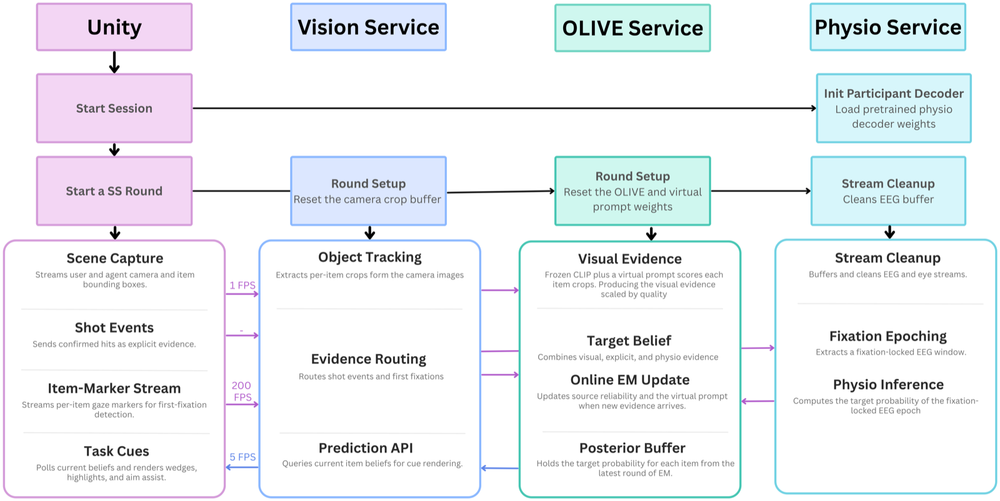
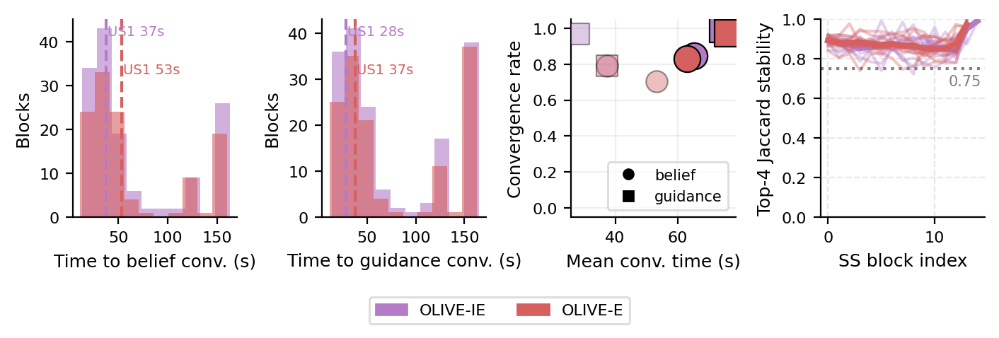
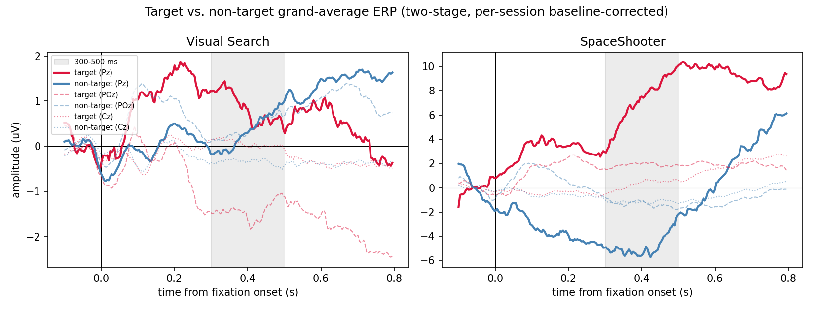

<div align="center">

# 🫒 OLIVE

### Augmenting Human Performance with an XR Agent Learning from Online Behavior and BCI Evidence

**Online Latent Inference from Variable Evidence**

Ziheng "Leo" Li\* · Xichen He\* · Haoyan Chen\* · Charlie Zou\* · Sheng Bai · Benjamin Yang · Mengyuan Wu · Jake Ledner · Yi-Jie Cheng · Akito Yamauchi · Dishita G. Turakhia · Steven Feiner · Paul Sajda


<p align="center">
  
</p>

<em>OLIVE fuses <b>explicit</b> behavioral evidence (what the user acts on) and <b>implicit</b> physiological evidence (fixation-locked EEG) online into a frozen vision–language model, learning per-source reliability without labels — and drives an XR agent that highlights task-relevant targets in real time.</em>

</div>

---

## TL;DR

OLIVE adapts a **frozen CLIP** at test time via a small virtual prompt, using an **online EM** loop that fuses noisy behavioral + neural evidence and estimates each channel's reliability on the fly. This repository contains the **algorithm**, an **exact reproduction** of the paper's Tables 2–8 and Figure 6, and two **released datasets** (fixation-related potentials + an ERN variant).

## Abstract

> We present **OLIVE**, a framework for adapting a foundation model to provide real-time assistance in temporally demanding, high-stakes, and dynamic tasks. We show that passive EEG, fused online with behavioral evidence, can meaningfully extend the number of targets users detect and engage beyond their unaided action bandwidth. OLIVE learns from both *explicit behavioral signals* (the targets the user shoots down in an XR first-person shooter game) and *implicit physiological signals* (fixation-locked EEG) to provide timely guidance, continuously adapting a frozen vision–language model's inference on which items are task-relevant by jointly estimating per-source reliability without manual labels or offline training. Through three user studies — including two live deployments of an assistive agent driven by OLIVE in XR — we show that OLIVE outperforms prior test-time adaptation frameworks in convergence speed and likelihood, produces the largest and most reliable within-session improvement to a user's ability to detect and engage targets (largely independent of skill), and, when the target switches silently, reconverges **1.27× faster** than a behavior-only agent (*p* = .008).

## Method

<p align="center">
  
</p>

Each evidence channel is treated as a **noisy annotator** contributing a log-likelihood ratio toward item relevance: a frozen VLM scores visual crops, positive-only actions form an explicit channel, and fixation-locked EEG forms an implicit channel. An **online EM** accumulates these into per-item beliefs (E-step) and re-estimates each channel's reliability + the VLM prompt (M-step) — anchored so beliefs can never collapse or invert polarity. The decoder is **pluggable** (`olive/decode.py`); OLIVE only needs a per-fixation probability.

## Key results

<p align="center">
  
</p>

Every paper table and figure regenerates exactly from committed recipes:

| Result | Highlight |
|---|---|
| **Table 2** — convergence | OLIVE-IE reaches **96.8% guidance convergence in 28.3 s** (US1); live US2 tracks it |
| **Table 3/7** — within-session gain | OLIVE-IE gives the largest throughput improvement (US2 Δ +0.031, *p*=.003) |
| **Table 6** — silent-switch reconvergence | OLIVE-IE reconverges **1.27× faster** than behavior-only (*p*=.008) |
| **Fig 6** — trust growth | OLIVE-IE gaze-reliance grows significantly while behavior-only erodes |

Run it yourself: `python -m release.reproduce.reproduce_all` → **Tables 2–8 + Fig 6, all PASS**.

## Repository layout

| Path | What |
|---|---|
| `olive/server.py` | decoder-free OLIVE gRPC server (online EM + CLIP scorer) |
| `olive/decode.py` | the pluggable `decode()` seam (default per-fixation decoder) |
| `reproduce/` | one wrapper per paper table/figure + `reproduce_all.py` |
| `dataset/` | FRP dataset builder + `dataset/ern/` (ERN variant) |
| `examples/` | ERP and subject-transfer example notebooks |
| `common/cohort.py` | cohort constants · `AGENTS.md` | working-with-agents guide |

## Installation

```bash
git clone https://github.com/ApocalyVec/olive && cd olive
python -m venv .venv && . .venv/bin/activate
pip install -r requirements.txt         # + the parent OLIVE repo's requirements
mkdir -p save_files                     # cache dir for the US1 simulation
```

> **Note:** the reproduction wrappers call analysis scripts from the main OLIVE research
> repo (`analysis/repro/…`) and the dataset builders read `~/wingman/`; run this release
> from inside a checkout of the full repo. See [`REPRODUCE.md`](REPRODUCE.md).

## Quickstart

```bash
# 1) Boot the OLIVE server (CLIP ViT-B/16; CPU / MPS / CUDA)
PYTHONPATH=. python -m olive.server --port 50055

# 2) Reproduce the US1 convergence benchmark end-to-end
PYTHONPATH=. python -m reproduce.us1 --participants 5 20 --steps 90 --num-trials 5 \
    --addr localhost:50055 --output-dir outputs/us1
PYTHONPATH=. python -m reproduce.us1_convergence outputs/us1/secondStats.csv

# 3) Reproduce every US2/US3 table + figure from the logged data (no server needed)
PYTHONPATH=. python -m reproduce.reproduce_all
```

## 🤗 Dataset

Two configs on the [**Hugging Face dataset**](https://huggingface.co/datasets/ApocalyVec/olive-frp):

```python
from datasets import load_dataset
frp = load_dataset("ApocalyVec/olive-frp", "default")  # fixation-locked FRP epochs
ern = load_dataset("ApocalyVec/olive-frp", "ern")      # response-locked ERN epochs
```

- **`default`** — per-fixation EEG (20 ch, [-0.1, 0.8] s) + pupil epochs, target label (`y==1`=target), a per-block `task` field (visual-search vs SpaceShooter), condition/block metadata, and a per-fixation implicit-evidence `p_target` (US2/US3). 25 subjects.
- **`ern`** — response-locked EEG ([-200, 600] ms) labeled error (friendly fire) vs correct (enemy hit).

<table>
<tr>
<td width="50%"></td>
<td width="50%"></td>
</tr>
<tr>
<td align="center"><a href="examples/erp_target_vs_nontarget.ipynb">Target-vs-non-target ERP (VS &amp; SS)</a></td>
<td align="center"><a href="examples/subject_transfer_decoding.ipynb">Leave-one-subject-out transfer decoding</a></td>
</tr>
</table>

## Reproducing the paper

`REPRODUCE.md` documents the exact command, cohort/drop set, and expected cells for every
target. `reproduce_all.py` checks each reproduced value against the paper and reports PASS/FAIL.
US2/US3 numbers come from analysis over the live-logged posteriors; US1 is a seeded simulation
re-run through OLIVE (deterministic by design, reproducible up to EM-timing jitter).

## Extending OLIVE

- **Bring your own decoder** — implement the `Decoder` protocol in `olive/decode.py`; the released
  `p_target` column is a baseline to compare against.
- **Tune the EM** — prompt lr, prevalence anchor, EMA smoothing — and measure with
  `reproduce/us1_convergence.py`.

See [`AGENTS.md`](AGENTS.md) for a full working-with-agents guide.

## Citation

```bibtex
@inproceedings{li2026olive,
  title     = {Augmenting Human Performance with an XR Agent Learning from
               Online Behavior and BCI Evidence},
  author    = {Li, Ziheng and He, Xichen and Chen, Haoyan and Zou, Charlie and
               Bai, Sheng and Yang, Benjamin and Wu, Mengyuan and Ledner, Jake and
               Cheng, Yi-Jie and Yamauchi, Akito and Turakhia, Dishita G. and
               Feiner, Steven and Sajda, Paul},
  booktitle = {Proceedings of the 38th Annual ACM Symposium on User Interface
               Software and Technology (UIST)},
  year      = {2026}
}
```

## License

Code and dataset are released under the terms in [`LICENSE`](LICENSE) (intended MIT for code /
CC-BY-4.0 for the dataset; confirm before public release). \* denotes equal contribution.
